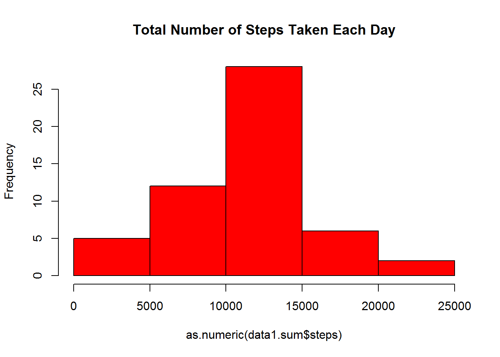
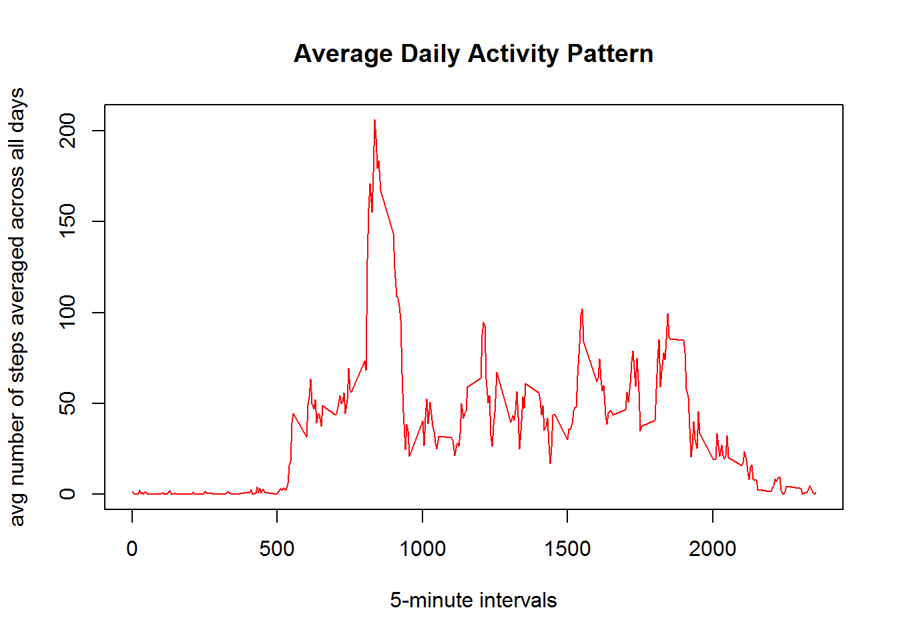
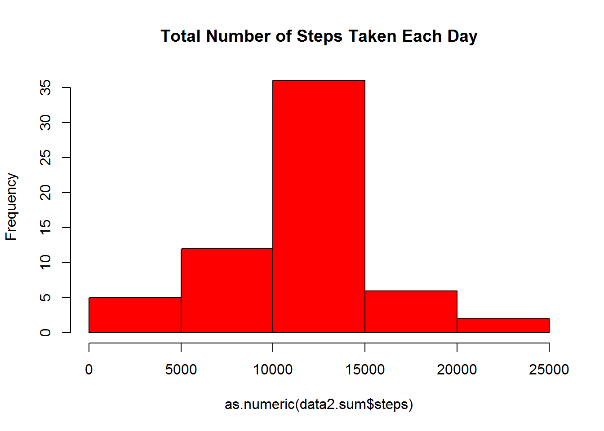
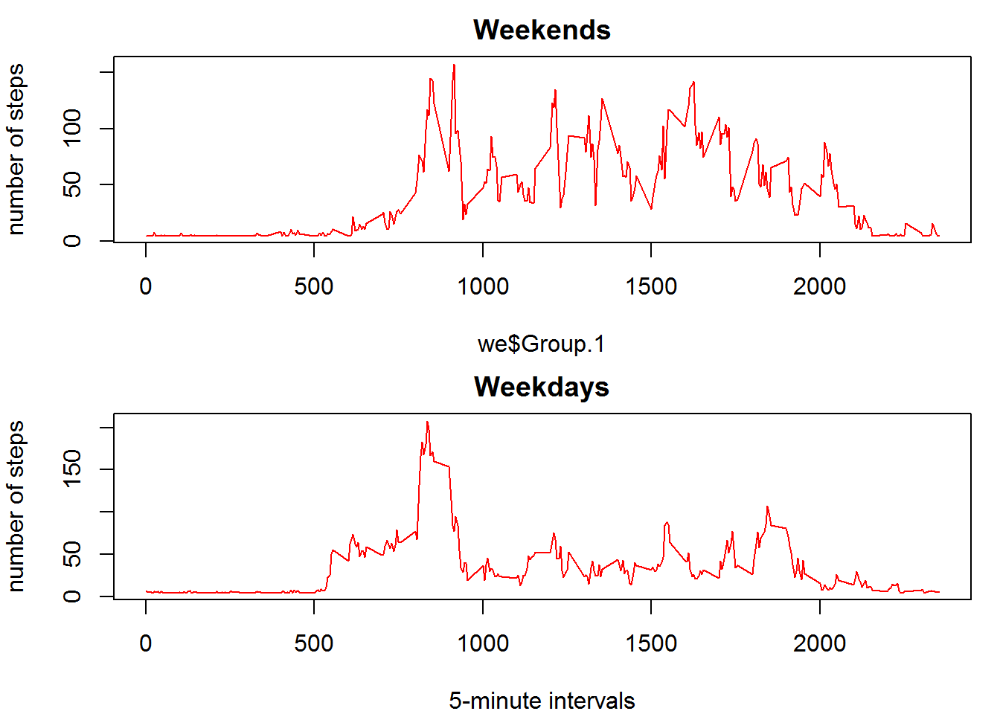

Reproducible Research: Peer Assessment 1
========================================


```r
knitr::opts_chunk$set(fig.path = 'figures/')
```

**Overview**
This project analyzes personal movement data collected with personal monitoring devices like *Fitbit*.  Source data collected in five minutes intervals over a two month period was analyzed. The original data was forked from GitHub and cloned to my pc for processing.  The original data, my R programming code and results are included in this GitHub repository.

## Loading and preprocessing the data
The source data for this project is the *activity.zip* file located within the *RepData_Assessment1* folder.  Three steps are required to read this file into R Studio.  These steps are:

1. Set the working directory. Manually run this command in the console:  setwd("c:/Users/Owner/ReproducibleResearch1/RepData_PeerAssessment1")
2. Manually run this command in the console: knitr::knit2html("./PA1_template.Rmd","./PA1_template.html")
3. Unzip the file. (see code chunk below)
4. Read the file into R. (see code chunk below)

The result of these steps produces a file called *data* which is then processes.  The code to do this is:


```r
# --- unzip the file
unzip("c:/Users/Owner/ReproducibleResearch1/RepData_PeerAssessment1/activity.zip", files = NULL, list = FALSE, overwrite = TRUE,
      junkpaths = FALSE, unzip = "internal", setTimes = FALSE)

# --- read the file into R
data = read.table("c:/Users/Owner/ReproducibleResearch1/RepData_PeerAssessment1/activity.csv", header=TRUE, sep = ',')
```

## What is mean total number of steps taken per day?
I first calculate the total number of steps taken per day.  The code to do this is:

```r
# sum the steps by date
data1.sum <- aggregate(x = data[c("steps")],
                     FUN = sum,
                     by = list(Group.date = data$date))
```

Next I made a histogram of the total number of steps taken each day.  The code to do this is:

```r
# create histogram of the total number of steps taken each day
hist(as.numeric(data1.sum$steps), 
     main = "Total Number of Steps Taken Each Day", 
     col = "Red")
```

 

Finally I calculated the mean and median of the total number of steps taken per day.  The code to do this is:

```r
# Calculate and report the mean of the total number of steps taken per day
m <- mean(data1.sum$steps, na.rm = TRUE)
m
```

```
## [1] 10766.19
```

```r
# Calculate and report the median of the total number of steps taken per day
median(data1.sum$steps, na.rm = TRUE)
```

```
## [1] 10765
```
**The mean is 10766.19 and the median is 10765.**

## What is the average daily activity pattern?
To answer this question, I first calculated the average number of steps by interval and then made a time series plot of the 5-minute interval (x-axis) and the average number of steps taken, averaged across all days (y-axis).
The code to do this is:

```r
# --- summarize the data -- calc the mean steps by interval to data frame mi
mi = aggregate(data$steps, list(data$interval), na.rm = TRUE, mean)

# --- plot the data
plot(mi$Group.1, mi$x, type ='l',   main = "Average Daily Activity Pattern", col="Red", 
     xlab = "5-minute intervals", ylab = "avg number of steps averaged across all days")
```

 

Which 5 minute interval, on average across all the days in the dataset, contains the maximum number of steps?  The code to answer this is:

```r
# get the largest value of avg number of steps in intervals
mx <- max(mi$x, na.rm = TRUE)
mx
```

```
## [1] 206.1698
```

```r
#get the row number of this largest number
r <- which(mi$x == mx)
# get the time interval in the row with the largest number (format is -hmm)
mi[r,1]
```

```
## [1] 835
```
**8:35 AM is the time interval that contains the maximun of steps.**


## Imputing missing values
There are a number of days and intervals where there are missing values in the data (coded as NA).  In this part of the analysis I filled in those missing values.
First I calculated the total number of missing values in the dataset (i.e. the total number of rows with NAs).

```r
# calculate the total number of missing values in the dataset
sum(is.na(data$steps))
```

```
## [1] 2304
```
**There are 2304 missing values.**

Next I devise a strategy for filling in all of the missing values in the dataset using the **mean for the day divided by the number of intervals per day (288)**. 
I then create a new dataset that is equal to the original dataset but with the missing data filled in.  I made a histogram of the total number of steps taken each day.  The code is:

```r
data2 <- as.data.frame(data) # copy the dataset to data2
# data2[is.na(data2)] <- 0  # replace na with 0
data2[, 1][is.na(data2[, 1])] <- m/288 # replace na with daily mean / 288 intervals

data2.sum <- aggregate(x = data2[c("steps")],
                       FUN = sum,
                       by = list(Group.date = data2$date))

# create histogram of the total number of steps taken each day
hist(as.numeric(data2.sum$steps), 
     main = "Total Number of Steps Taken Each Day", 
     col = "Red")
```

 

The mean and median total number of steps taken per day were recalculated using the filled in data.

```r
# Calculate and report the mean of the total number of steps taken per day
mean(data2.sum$steps)
```

```
## [1] 10766.19
```

```r
# Calculate and report the median of the total number of steps taken per day
median(data2.sum$steps)
```

```
## [1] 10766.19
```
**The mean with the filled-in data is 10766.19.  This is the same as the mean without the data.  The median with the filled-in data is 10766.19 versus 10765 which is almost identical.  Using this method of filling in the missing data did not dramically change the results.**


## Are there differences in activity patterns between weekdays and weekends?
To answer this question I performed the follow steps:

1. Converted the date field's format to a date format.
2. Determined the day of the week that the date represents.
3. Determined if the date was a weekday or weekend.
4. Seperate the file into two file based on weekend or weekday.
5. Calculate the mean of each file.
6. Made a panel plot containing a time series plot of the 5-minute interval (x-axis) and the average number of steps taken, averaged across all weekday days or weekend days (y-axis).
The code to do this is:


```r
my.date <- as.Date(data2$date) # convert date to date format

data2$day <- weekdays(my.date <- as.Date(data2$date)) # add column with the day of the week

data2$dayType <- as.character("weekday") # add column for type of day and prefill with "weekday"

data2$dayType[data2$day == "Saturday"] <- "weekend"  # change to weekend
data2$dayType[data2$day == "Sunday"] <- "weekend"

data2Weekday <- data2[data2$dayType  ==  "weekday", ] # extract weekday data
data2Weekend <- data2[data2$dayType  ==  "weekend", ] # extract weekend data

# --- summarize the weekday data -- calc the mean of steps by interval to data frame wd
wd = aggregate(data2Weekday$steps, list(data2Weekday$interval), na.rm = TRUE, mean)

# --- summarize the weekday data -- calc the mean of steps by interval to data frame wd
we = aggregate(data2Weekend$steps, list(data2Weekend$interval), na.rm = TRUE, mean)

par(mfrow = c(2, 1), mar = c(4, 4, 2, 1))
plot(we$Group.1, we$x, type ='l',   main = "Weekends", col="Red", 
     ylab = "number of steps")
plot(wd$Group.1, wd$x, type ='l',   main = "Weekdays", col="Red", 
     xlab = "5-minute intervals", ylab = "number of steps")
```

 
